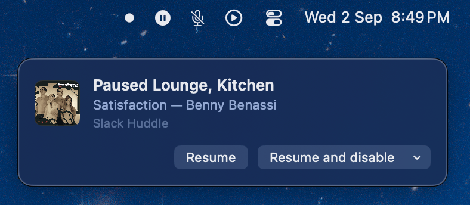
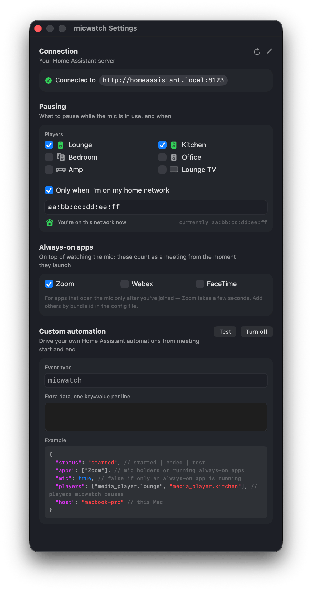

A macOS menu bar app that pauses your music while the microphone is in use, and
resumes it afterwards.

It detects calls by watching **whether any app is holding the microphone**, not by
integrating with meeting apps. Slack huddles, Zoom, Google Meet, Teams, FaceTime
and anything else all work with no per-app code, including apps that didn't exist
when this was written and calls that were never on a calendar.

Music is paused through **Home Assistant**, so it works regardless of which device
is playing — a Sonos speaker keeps being controllable whether or not the desktop
app is even open.

Inside the app everything is described as the microphone being in use, because
that is what it actually observes: dictation and voice memos trip it too, and it
has no way to tell those from a call.

## Setup

```
make identity   one-time: create a local code signing identity
make install    build, sign, and install to /Applications
```

Then open **Settings** from the menu bar icon, enter your Home Assistant URL and a
long-lived access token, and tick the media players to pause. Create the token in Home
Assistant under your profile → Security → Long-lived access tokens; the settings
window links straight to that page once a URL is entered. **Open at Login** is in
the same menu.

<div align="center">

</div>

`make build` builds without installing, `make selftest` opens the microphone and
asserts the detection path notices, `make clean` removes the build.

## While the mic is in use

A panel fades in when the music is paused, showing the album art, what was
playing, and which app took the microphone. It offers the choices that apply to
that pause only:

- **Resume** — give the music back now; the mic being released later won't touch it
- **Resume and disable** — resume and stay out of the way for an hour, a day, a week
- **✕** — dismiss the panel, changing nothing

Ignore it and the default applies: resume when the microphone is free. It fades
after six seconds, holds while hovered, and reappears when you hover the menu bar
icon, so missing it isn't a dead end. It never takes focus.

## Behaviour

- Pauses only if the player is **actually playing**; anything else is left alone.
- Resumes only what **it** paused. If you paused the speaker yourself, or it was
  already paused, the mic being released won't start music in an empty room.
- Waits 250ms before pausing, so an app that grabs the mic and releases it
  immediately doesn't interrupt anything. Resuming is never delayed.
- The menu bar icon shows one of two states — paused, or not — and fades to 40%
  whenever it won't act: disabled, away from home, Home Assistant unreachable, or
  not yet configured.
- **Disable** offers 1 hour, 3 hours, 1 day, 1 week, or until you re-enable it.
- The player's `friendly_name` is stored alongside its entity id and refreshed
  whenever the entity is read, so renaming it in Home Assistant follows through.
- The settings picker shows each entity's `device_class` as an icon — speaker,
  television, receiver — and a two-speaker glyph when it belongs to a group.
  Pausing one member of a group isn't the same as pausing the group.

## Home network gate

Pausing can be restricted to your home network, identified by the **default
gateway's MAC address** rather than the Wi-Fi SSID — which needs a paid developer
entitlement and a location permission, and identifies the network far more
loosely. See [RESEARCH.md](docs/RESEARCH.md#home-network-gate).

The gate covers pausing only, never resuming, so a speaker can't be stranded
paused if the call ended after you left the house.

## App detection

Some apps only open the microphone once you've actually joined — Zoom takes a few
seconds after its window is up — so the music plays on into the start of the
call. On top of watching the mic, Settings has a list of always-on apps that count
as a meeting **from the moment they launch**, mic or not. Zoom is checked by
default; Webex and FaceTime are offered unchecked. Anything else goes in the
`apps` array of the config file as a bundle id, and shows up in the list.

## Home Assistant events

Off by default. When enabled, micwatch fires one event — `micwatch` unless you
rename it — with a `status` of `started`, `ended` or `test`, plus `apps`, `mic`, `players`,
`host` and any extra `key=value` pairs you add in Settings. It goes out after the
same 250ms debounce as the pause, and regardless of the home network gate or a
disable, so your automations decide what applies where. Home Assistant only lets
**admin** users fire events over its API, so the token has to come from an admin
account — the Test button in Settings says so if it's rejected.

```yaml
trigger:
  - platform: event
    event_type: micwatch
    event_data: { status: started }
```

## Configuration

`~/.config/micwatch.json` holds the URL, entity id, display name, home router
address, watched apps and event settings. Editing it by hand is picked up live, and it's only written when a value
actually changed, so an editor holding it open is never told that another
application modified it.

The Home Assistant token lives in `~/.config/micwatch-token`, mode `0600`, never
in the config file — so the config stays safe to read, copy or commit. See
[RESEARCH.md](docs/RESEARCH.md#credentials) for why it isn't in the Keychain.

## Command line

The build produces one executable, inside the bundle:

```
cd /Applications/micwatch.app/Contents/MacOS
./micwatch --once       idle | mic in use: Slack, Zoom (mic, or a watched app running)
./micwatch --ha-state   entity state, plus the home-network gate
./micwatch --hold N     hold the mic for N seconds, to test from another shell
./micwatch --selftest   opens the mic, asserts the listener path notices
./micwatch --demo DIR   fake data, no Home Assistant: holds the card and settings open for screenshots
```

## Requirements

macOS 14+, Swift toolchain (Xcode Command Line Tools), a Home Assistant instance.
No third-party dependencies.

[docs/RESEARCH.md](docs/RESEARCH.md) covers how detection works and the platform behaviour
that shaped it.
